# Application Flow Documentation

## Overview
This document outlines the key user flows and system processes within the DocuGen application. It serves as a guide for understanding how users interact with the system and how data flows through the application.

## User Journeys

### 1. New User Onboarding
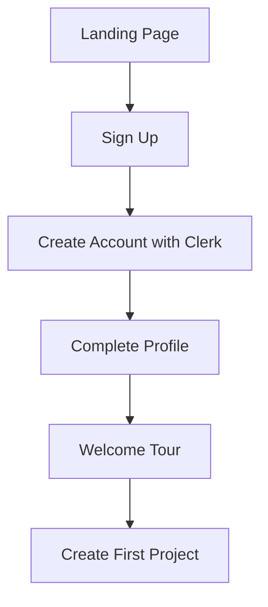

**Details:**
1. User arrives at landing page and views product benefits
2. User clicks "Sign Up" or "Get Started Today"
3. User completes Clerk Auth registration process
4. User fills out additional profile information
5. User is guided through a brief welcome tour of features
6. User is prompted to create their first project

### 2. Project Creation Flow
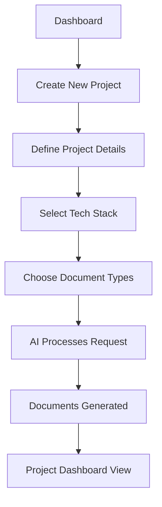

**Details:**
1. User navigates to Dashboard and clicks "Create New Project"
2. User enters project name, description, and objectives
3. User selects default tech stack or customizes it
4. User selects which document types to generate
5. AI processes the request and generates documentation
6. Generated documents are saved to the project
7. User is redirected to the project dashboard view

### 3. Document Generation Flow
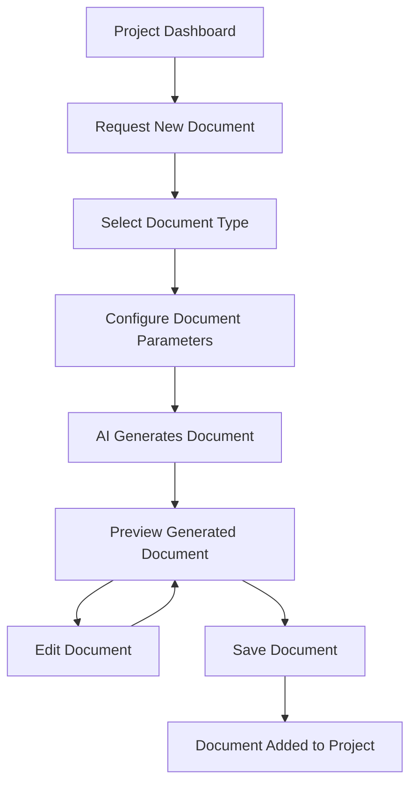

**Details:**
1. From the project dashboard, user clicks "Generate New Document"
2. User selects the type of document to generate
3. User configures specific parameters for the document
4. AI processes the request and generates documentation
5. User previews the generated document
6. User can edit the document if needed
7. User saves the final document to the project

### 4. Subscription Management Flow
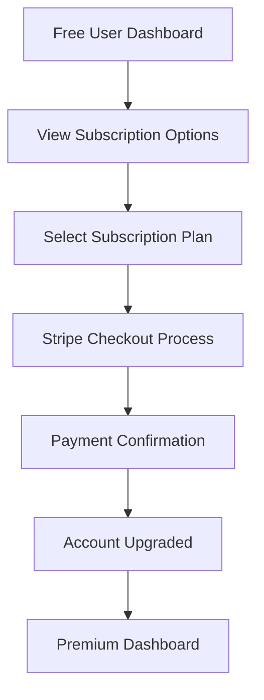

**Details:**
1. Free tier user views subscription options
2. User selects a subscription plan
3. User completes payment through Stripe checkout
4. User receives payment confirmation
5. User account is upgraded to the selected plan
6. User is redirected to the premium dashboard with new features

## System Processes

### 1. Authentication Process
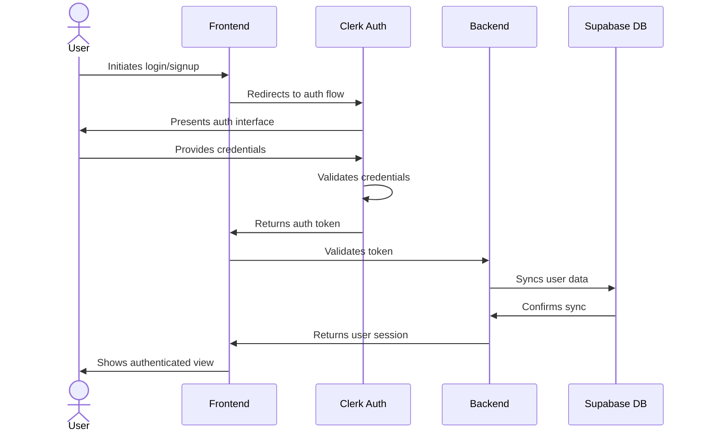

### 2. Document Generation Process
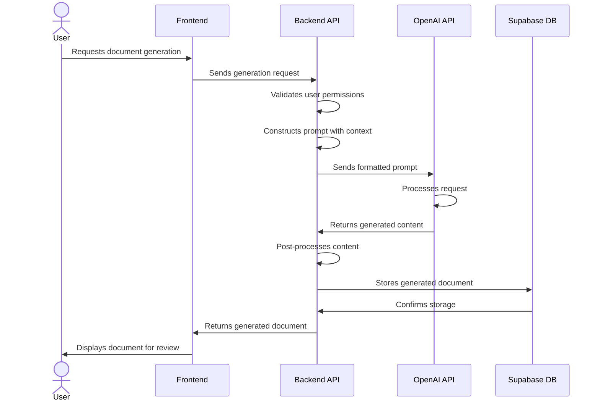

### 3. User Usage Tracking Process
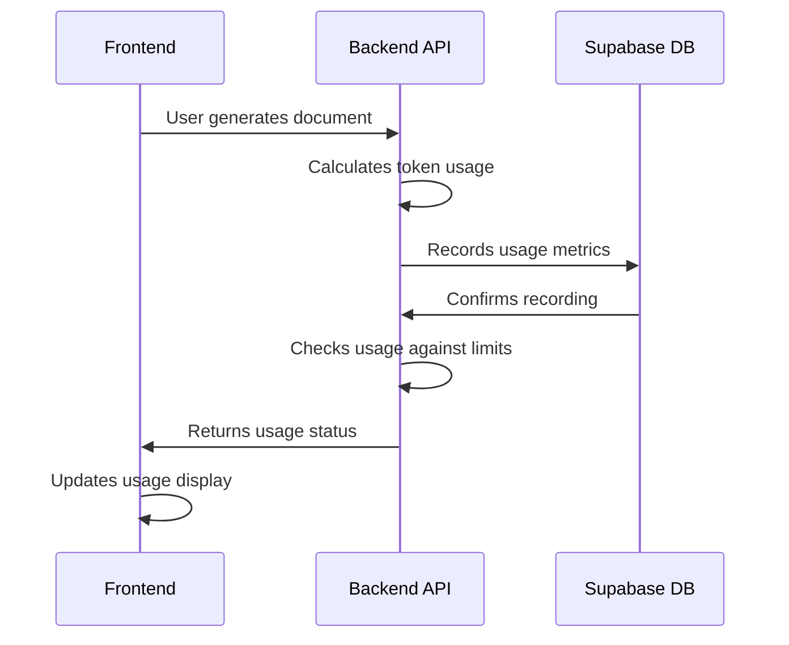

## State Transitions

### Project State Transitions
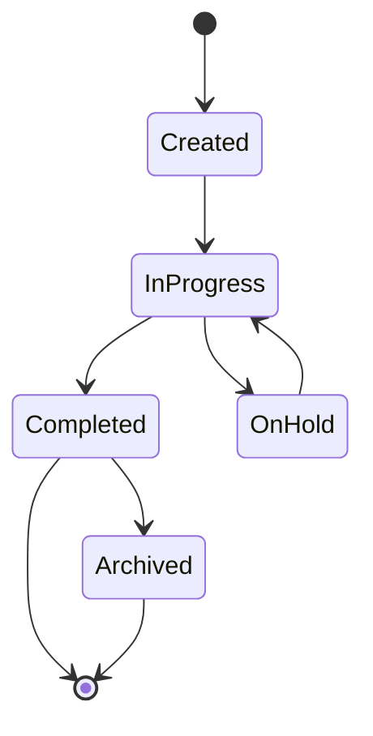

### Document State Transitions
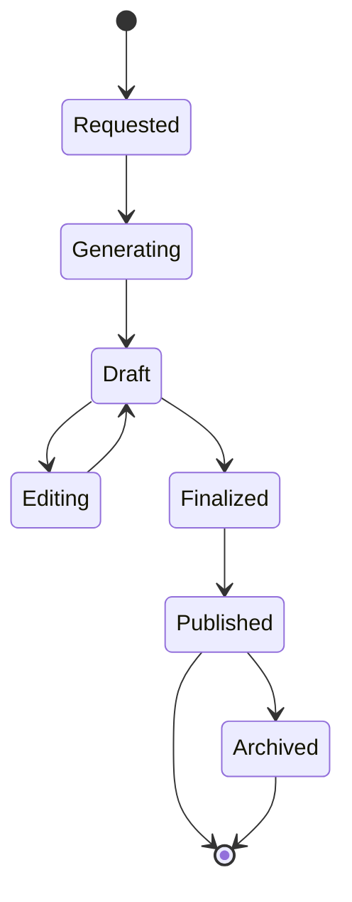

## Key Interaction Points

### Dashboard Navigation
1. **Main Dashboard**
   - Project list view
   - Recent activity
   - Usage metrics
   - Quick actions

2. **Project Dashboard**
   - Document list
   - Project details
   - Generation options
   - Collaboration settings

3. **Document View**
   - Document content
   - Edit options
   - Export options
   - Version history

### Modal Interactions
1. **Create Project Modal**
   - Project name and description
   - Tech stack selection
   - Document type selection

2. **Document Generation Modal**
   - Document type selection
   - Parameter configuration
   - Generation options

3. **Subscription Modal**
   - Plan comparison
   - Feature highlights
   - Payment method selection

## Error Handling Flows

### Authentication Errors
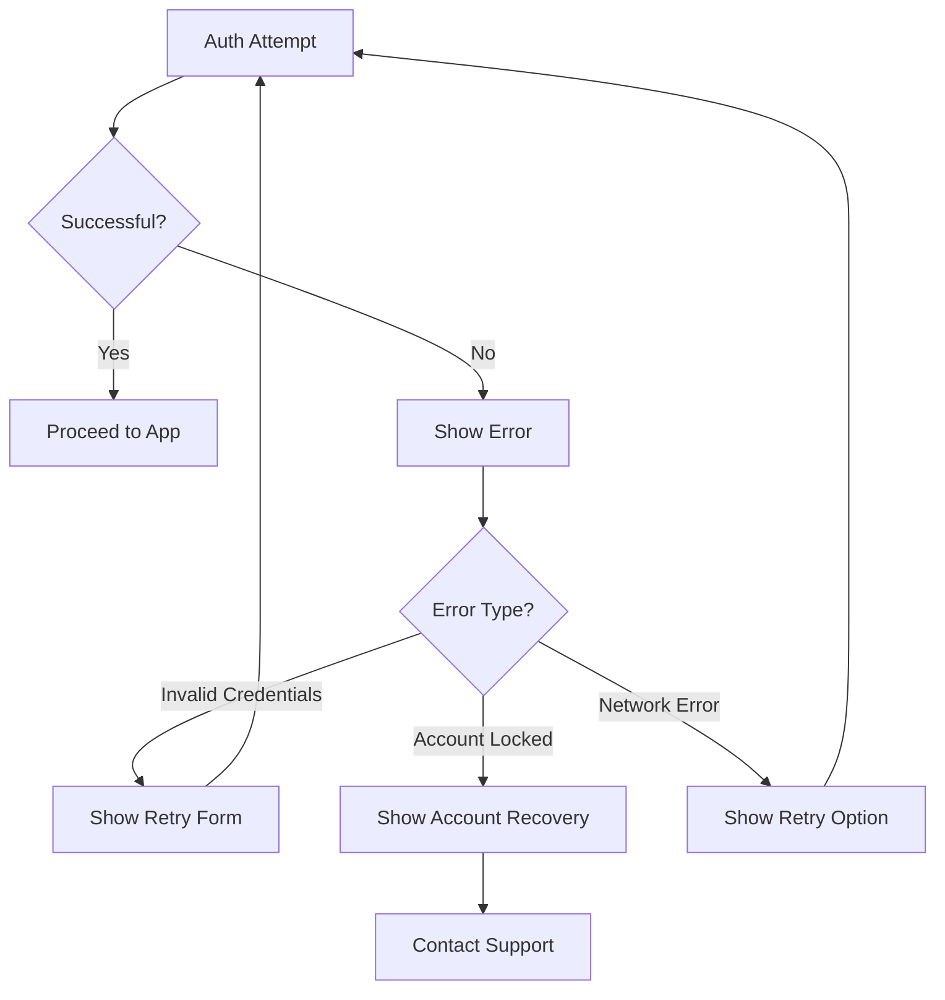

### Document Generation Errors
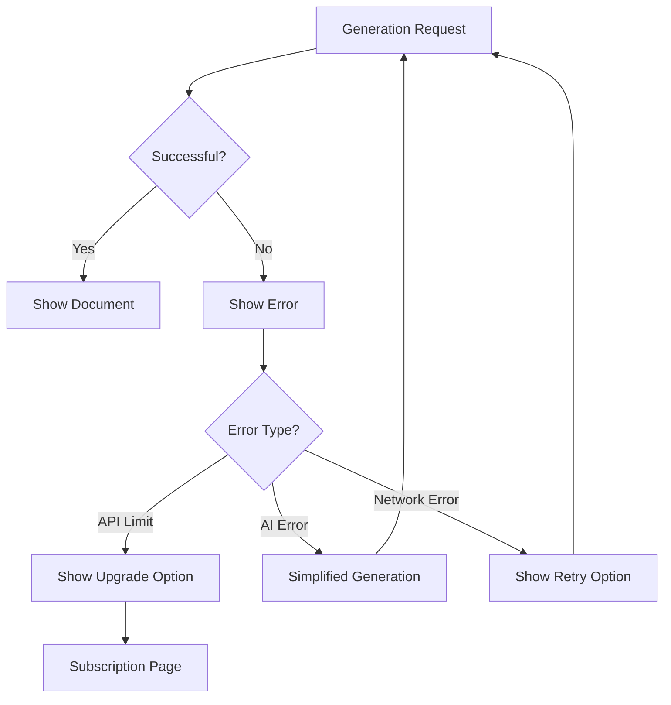

## Mobile-Specific Flows
1. **Simplified Navigation**
   - Bottom navigation bar for core features
   - Collapsible sidebar menu for secondary features
   - Back button navigation pattern

2. **Responsive Document View**
   - Simplified document preview
   - Touch-optimized editing interface
   - Horizontal swipe for document navigation

## Integration Touchpoints

### Clerk Auth Integration
- Sign up flow
- Login flow
- Password reset
- Account management
- MFA setup

### OpenAI API Integration
- Document generation requests
- Content refinement
- Template customization
- System prompt management

### Stripe Integration
- Subscription selection
- Payment processing
- Invoice management
- Subscription management

### Supabase Integration
- Data storage
- Real-time updates
- Document versioning
- User preferences

## Feedback Loops
1. **Document Quality Feedback**
   - User ratings for generated documents
   - Specific feedback collection
   - Improvement suggestions

2. **Feature Request Flow**
   - In-app suggestion box
   - Upvoting mechanism for popular requests
   - Status updates for implemented features

## Performance Considerations
1. **Loading States**
   - Skeleton loaders for content generation
   - Progress indicators for lengthy operations
   - Optimistic UI updates for common actions

2. **Offline Support**
   - Cached document access
   - Offline editing capabilities
   - Synchronization when connection restored
